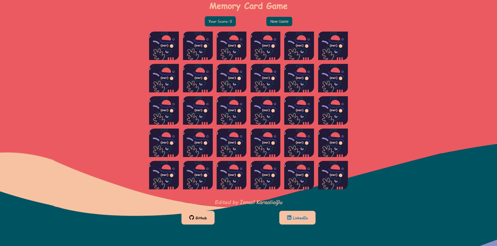
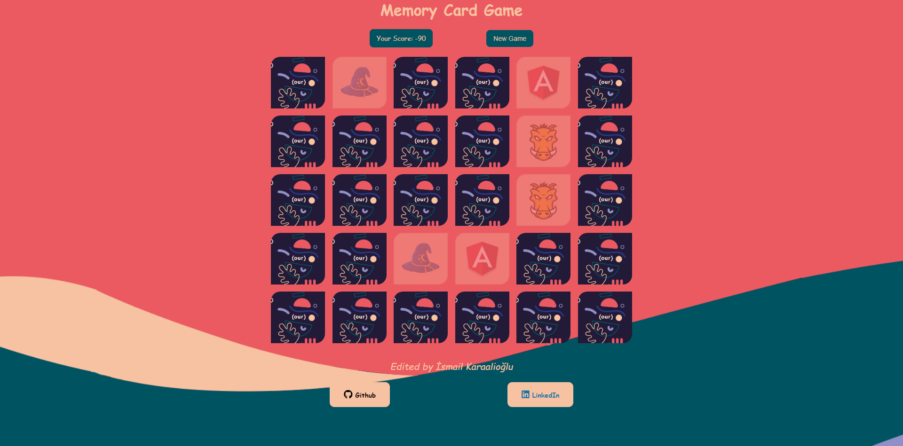
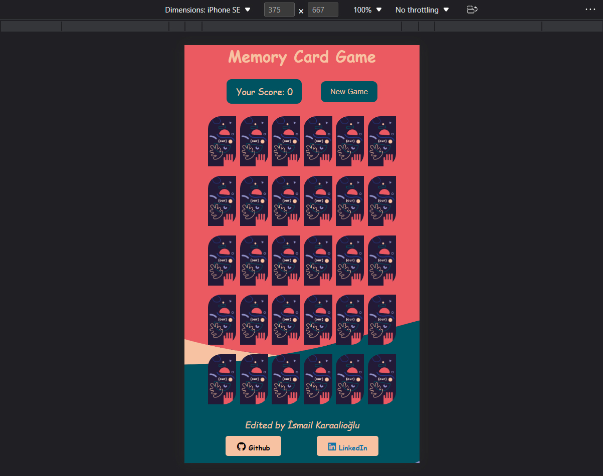

# React - MemoryCardApp

* Patika.dev Redux modülü "Memory Card" çalışması.
* State'leri global olarak yönetmek için `Redux` kullanılmıştır.

## Demo

[https://ismailkaraalioglu-memorycardgame.netlify.app/](https://ismailkaraalioglu-memorycardgame.netlify.app/)

## Screenshot

